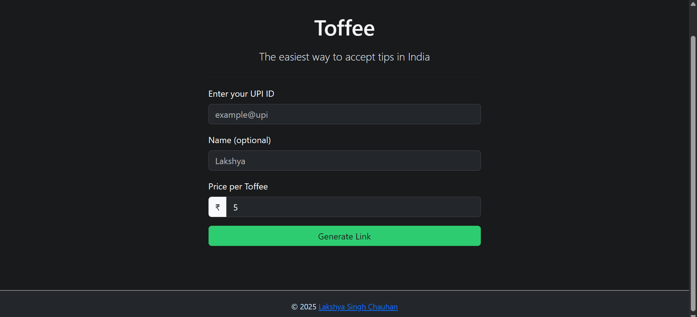
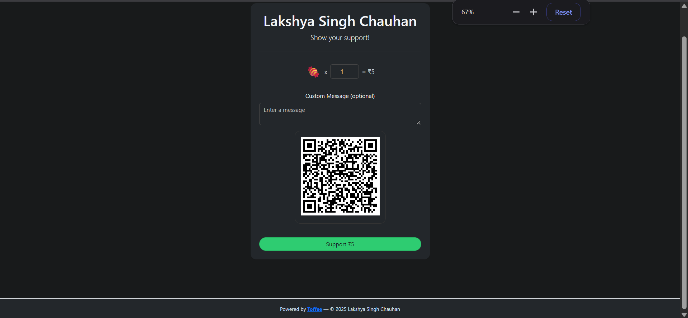

# 🍬 Toffee — Accept Digital Candy via UPI

Toffee is the easiest way to accept small payments (tips, support money, or donations) in India.  
It generates UPI tip links and lets you share them as a page or embed them on your website.

---

## ✨ Features

- 🪄 **Instant Setup** — Just enter your UPI ID and name, get a shareable link.
- 💸 **Custom Pricing** — Set how much each "toffee" costs (₹5, ₹10, etc).
- 📱 **Scan & Pay** — Auto-generated QR code for quick UPI payments.
- 🎨 **Embeddable Widget** — Drop the iframe code anywhere on your site/blog.
- 🌓 **Dark Mode Support** — Matches user’s system theme.
- ⚡ **100% Client-Side** — No backend, no servers, just HTML + JS.

---

## 🚀 Getting Started

### 1. Clone the repo
```bash
git clone https://github.com/YOUR-USERNAME/toffee.git
cd toffee
````

### 2. Open locally

Just open `index.html` in your browser. No build step needed.

### 3. Deploy

You can deploy instantly on:

* [Vercel](https://vercel.com)
* [Netlify](https://netlify.com)
* GitHub Pages

---

## 📖 How It Works

1. **Generate a tip link**

   * Go to `index.html`
   * Enter your UPI ID, name, and price per toffee
   * Click **Generate Link**

2. **Share it**

   * Direct link: `/payment.html?upi=example@upi&name=Lakshya&price=5`
   * Embed widget: `<iframe ...></iframe>`

3. **Get paid!**

   * Your supporters can scan the QR code or click the button to pay via UPI.

---

## 🛠️ Tech Stack

* **Frontend**: HTML, CSS, Bootstrap 5
* **QR Generator**: [QRious](https://github.com/neocotic/qrious)

---

## 📷 Screenshots

| Sign-up Page               | Payment Page (Light/Dark)    |
| -------------------------- | ---------------------------- |
|  |  |

---

## 💡 Use Cases

* Content creators accepting tips
* Open-source developers
* Small donations for blogs/websites
* College projects / hackathons

---

## 📝 License

MIT License © 2025 [Lakshya Singh Chauhan](https://lakshyasinghchauhan.com)